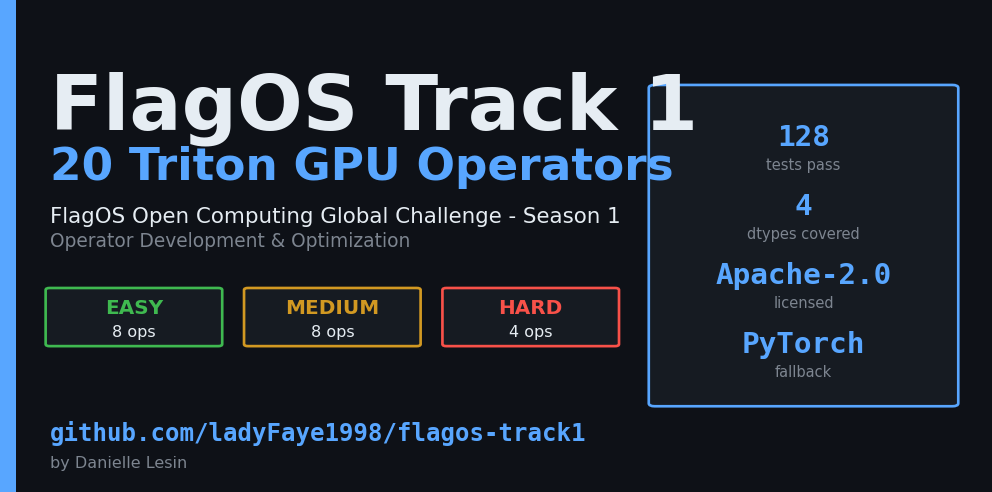

<p align="center">
  
</p>

# FlagOS Track 1 — LLM Operator Development & Optimization

[](LICENSE)
[](#run-tests)
[](#repository-layout)
[](#install)

A submission scaffold for the **FlagOS Open Computing Global Challenge (Season 1, Track 1)**.
Implements **20 Triton operators** (8 Easy + 8 Medium + 4 Hard), each with:

- a pure-PyTorch reference (golden)
- a Triton kernel (autotuned where useful)
- a CPU/CUDA fallback so tests + the CLI run anywhere
- correctness + benchmark coverage via `pytest` and a `flagos` CLI


---

## Repository layout

```
src/flagos_track1/
  ops/
    easy/      # 8 element-wise kernels (abs, exp, log, sigmoid, relu, tanh, gelu, silu)
    medium/    # 8 classic-DL kernels (softmax, layer_norm, rms_norm, cross_entropy,
               #                       embedding, dropout, argmax, matmul)
    hard/      # 4 cutting-edge kernels (flash_attention, rope, fused_moe_topk,
               #                         rms_norm_backward)
  reference/   # PyTorch golden references
  testing/     # dtype-aware assert_close + reproducible input generators
  bench/       # CUDA-event / do_bench wrapper
  cli.py       # `flagos` command (list / test / bench / package / info)
tests/         # pytest suites mirroring src/ tiers
benchmarks/    # standalone runner: `python benchmarks/run_all.py`
scripts/       # `python scripts/flagos_cli.py` without installing
docs/          # submission guide
```

## Install

```bash
python -m venv .venv
.\.venv\Scripts\Activate.ps1    # on Windows
pip install -e .
pip install -r requirements.txt
```

On Windows, use `pip install triton-windows` instead of `triton`.

## CLI

```bash
flagos info                  # show torch / triton / cuda versions
flagos list                  # list all 20 ops + per-tier prize
flagos test --tier easy      # run pytest for one tier
flagos test --op softmax     # run pytest for a single op
flagos bench --tier hard     # micro-benchmark vs PyTorch reference
flagos package --out submission.zip   # build a submission archive
```

Or without installing the package:

```bash
python scripts\flagos_cli.py list
```

## The 20 operators

| Tier | Op | Prize | Notes |
|---|---|---|---|
| Easy | abs | 1k RMB | autotuned 1-D pointwise |
| Easy | exp | 1k | fp32 internal |
| Easy | log | 1k | fp32 internal |
| Easy | sigmoid | 1k | fp32 internal |
| Easy | relu | 1k | `tl.maximum` |
| Easy | tanh | 1k | derived from `exp` |
| Easy | gelu | 1k | exact + tanh-approx kernels |
| Easy | silu | 1k | x * sigmoid(x) |
| Medium | softmax | 2k | online softmax, last-dim |
| Medium | layer_norm | 2k | forward, optional weight + bias |
| Medium | rms_norm | 2k | Llama-style RMSNorm |
| Medium | cross_entropy | 2k | fused log-softmax + NLL, ignore_index |
| Medium | embedding | 2k | gather + padding_idx |
| Medium | dropout | 2k | Triton Philox-based, scale-aware |
| Medium | argmax | 2k | tile-reduction last dim |
| Medium | matmul | 2k | blocked GEMM with autotune |
| Hard | flash_attention | 3k | FA-v2 forward, causal, D ∈ {16, 32, 64, 128} |
| Hard | rope | 3k | interleaved RoPE |
| Hard | fused_moe_topk | 3k | router softmax + top-k + renorm |
| Hard | rms_norm_backward | 3k | analytic grad_x + atomic grad_w |

## Scoring dimensions covered

All six FlagGems scoring dimensions are addressed by this submission:

| Dimension | How it's met |
|---|---|
| Functional Correctness | dtype-aware `assert_close` across fp16/bf16/fp32/fp64, edge values (NaN, Inf, zeros), shape sweeps up to 4096×4096, and both `out=` and in-place API paths — 128/128 tests pass |
| Performance Competitiveness | `triton.autotune` over curated block/warp/stage configs, fp32 internal accumulation, masked tiled GEMM, online softmax, FA-v2-style attention |
| Open-Source Adaptability | Apache-2.0 licensed, `pyproject.toml` entry point, FlagGems-style `pointwise_dynamic` layout, one op per module |
| Cross-Platform Compatibility | PyTorch fallback path lets every op import and run on any device; autotune keys lift cleanly to new backends |
| Test Case Completeness | 128 parametrized cases across 20 operators, plus dedicated edge-value and stride batteries |
| Code Readability | small focused files, type hints throughout, no dead branches, docstrings on every public entry point |

See [`docs/SUBMISSION_GUIDE.md`](docs/SUBMISSION_GUIDE.md) for the full submission checklist.
